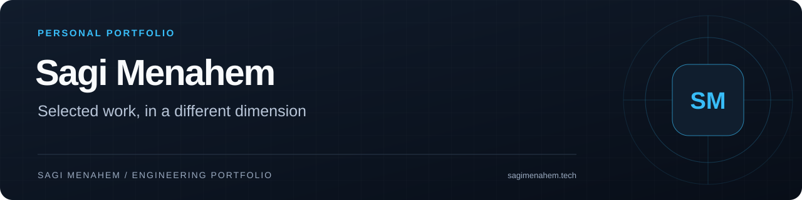
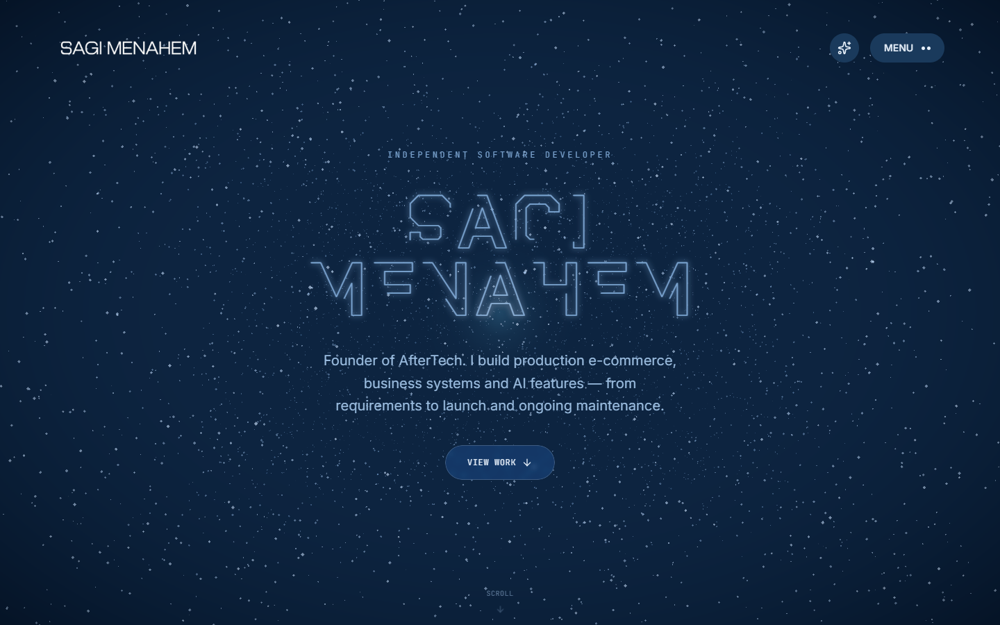
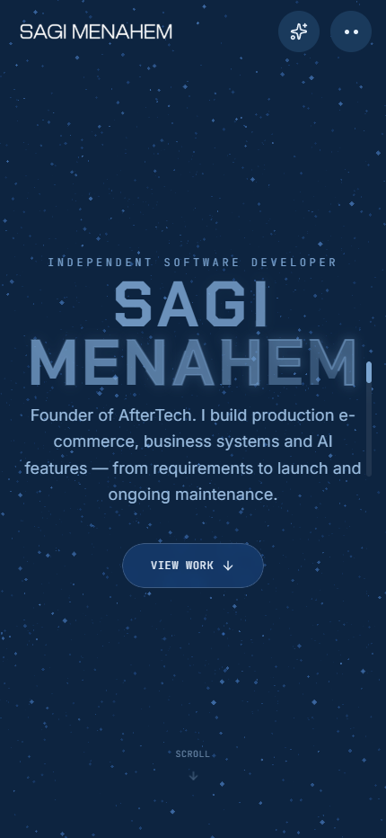

# Sagi Menahem Portfolio

My personal portfolio presents selected software work and the thinking behind it. It is an independent personal project by Sagi Menahem, founder of [AfterTech](https://www.after-tech.co.il/), built to make projects easy to explore without reducing the site to a static list of links.

**Project type:** personal portfolio · **Role:** designer and engineer · **Source:** private; this repository is a public case study. · [Visit the portfolio](https://sagimenahem.tech)

## Preview

  
  

## Problem and solution

A portfolio has to show both the finished work and the person making it. A conventional gallery is easy to scan but can feel detached from the engineering it represents; an immersive site can become an obstacle if the visual layer competes with the content.

This portfolio uses a 3D visual language as an entry point, then lets the browser step back when it is time to read. The result is a site with a distinct identity that still prioritizes project stories, navigation, and responsive use across desktop and mobile.

## Product highlights

- A custom visual world built around interactive particles, a scroll-driven fly-through, and SVG line work.
- Project-focused content that connects live work, case studies, and contact paths.
- Motion that adapts to the available screen and respects the operating system's reduced-motion preference.
- A responsive layout that preserves the content hierarchy when 3D treatment is reduced on smaller devices.

## Engineering decisions

The implementation separates canvas work from DOM content. Three.js components own the visual scene while React content remains independently renderable and accessible as regular page structure. That division makes it possible to evolve the visual treatment without turning every content change into a graphics change.

High-frequency scroll values stay in refs for animation instead of triggering React renders. Heavier visual components are initialized in stages, and particle geometry is prepared away from the main UI path. The design uses Astro for content delivery and React islands only where interactivity earns its cost.

The site favors graceful degradation over a single fixed visual effect. Desktop can use richer scrolling and post-processing while mobile retains native scrolling and a lighter presentation. Those choices keep the portfolio useful even when device capability differs.

## Stack

Astro, React, TypeScript, Three.js, React Three Fiber, GLSL, GSAP, Lenis, Zustand, Web Workers, and Tailwind CSS.

---

Built by **[Sagi Menahem](https://www.sagimenahem.tech/)** · [LinkedIn](https://www.linkedin.com/in/sagi-menahem/)
